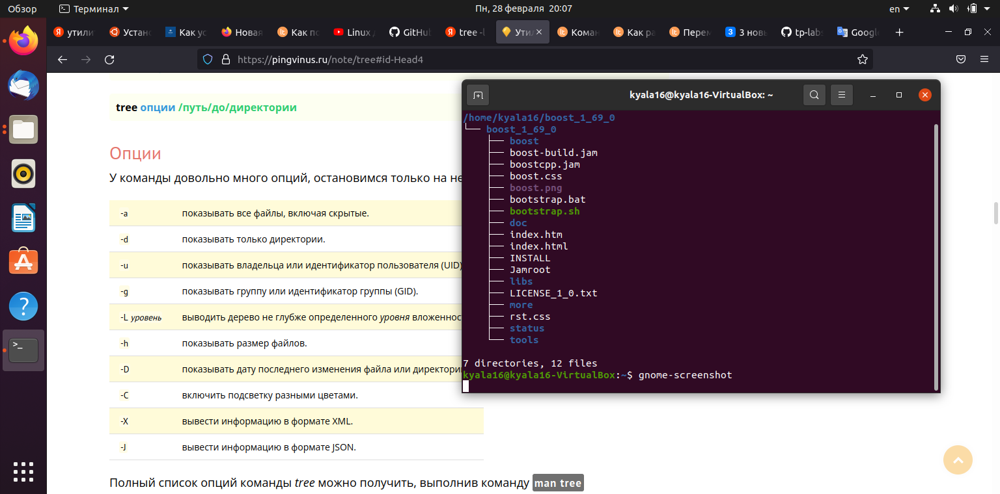

## Lab01

Скачиваем библиотеку boost(***Задание1***):

`wget https://sourceforge.net/projects/boost/files/boost/1.69.0/boost_1_69_0.tar.gz`

Разархивируем(***Задание2***):
	
`tar -xvf boost_1_69_0.tar.gz`	
	

	
Считаем количество не включая вложенные директории(***Задание3***):

`tree ~/boost_1_69_0 -L 1`
	

	
Считаем Включая вложенные(***Задание4***):

`tree ~/boost_1_69_0`
	

	
Считаем файлы(***Задание5***):

`find ~/boost_1_69_0 -name "*.cpp" | wc -l`

	1).cpp  13774
	2).h  296
	3).hpp  14912
	
	4)остальные  37847
	
	

	
Пути к any.hpp(***Задание6***):

`find ~/boost_1_69_0 -name "any.hpp"`
	

	
Где есть какая-то часть текста(***Задание7***):

`find ~/boost_1_69_0 -type f | xargs grep -i boost::asio`
	
Переносим в другую директорию(***Задание9***):

`mv * ~/boost-libs`
	

	
Смотрим вес файлов(***Задание10***):

`ncdu ~/boost-libs`
	

	
10 самых тяжелых(***Задание11***):

`ls -lS`
	
